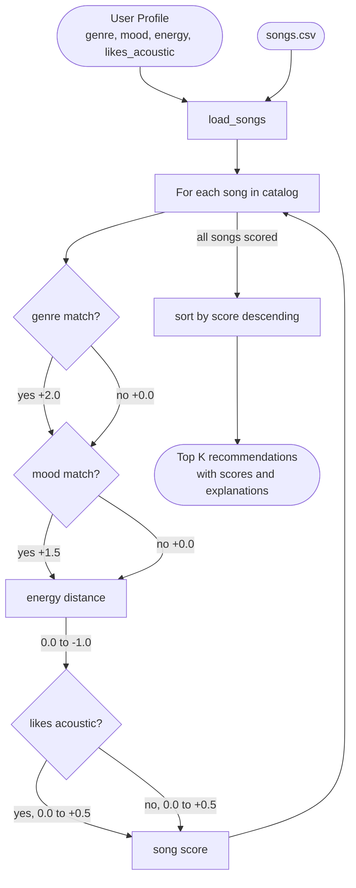
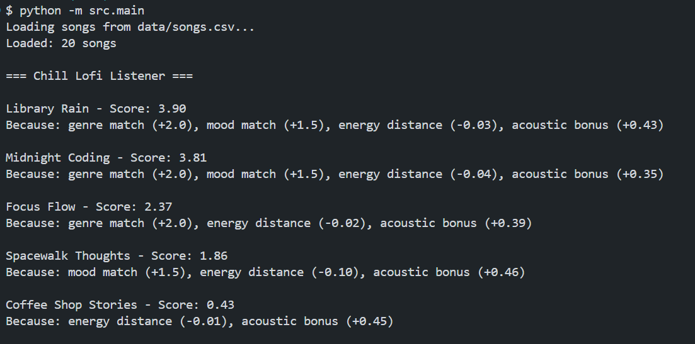
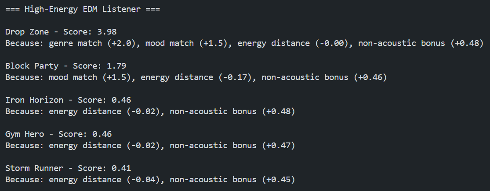
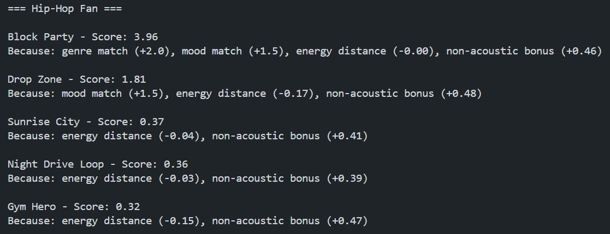
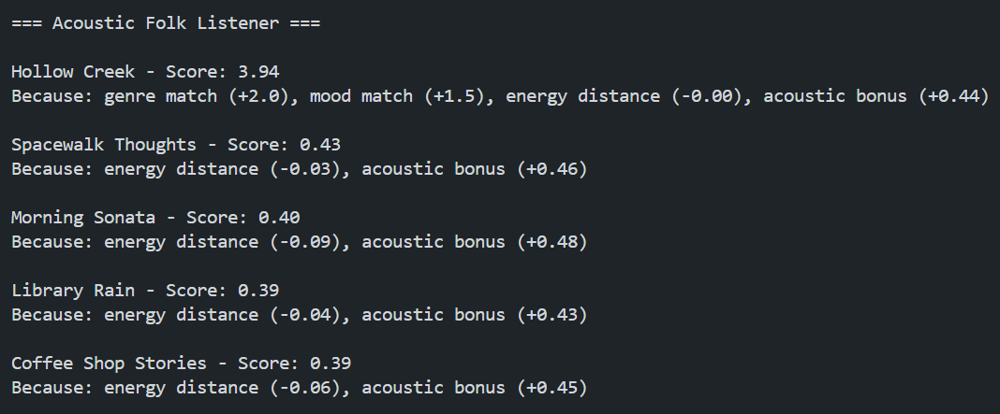

# 🎵 Music Recommender Simulation

## Project Summary

This project builds a content-based music recommender that scores songs from a 20-song catalog against a user taste profile. Each song is scored using genre match, mood match, energy distance, and acousticness preference. The top 5 results are returned with a plain-language explanation for each recommendation. Four user profiles are included: Chill Lofi Listener, High-Energy EDM Listener, Hip-Hop Fan, and Acoustic Folk Listener.

---

## How The System Works

Real-world recommenders like Spotify combine content-based filtering with collaborative filtering. Content-based filtering matches song attributes to your stated preferences. Collaborative filtering finds patterns across millions of users who listened to similar things. My simulation focuses on the content-based side. It scores each song by comparing its attributes against a user profile and surfaces the top matches. Genre and mood are the highest priority because those are how listeners describe what they want. Energy level adds numeric precision, and acousticness captures a secondary texture difference between organic and produced sounds.

**`Song` features used:** `genre`, `mood`, `energy`, `acousticness`, `valence`

**`UserProfile` fields used:** `favorite_genre`, `favorite_mood`, `target_energy`, `likes_acoustic`

### Algorithm Recipe

Each song in the catalog is scored against the user profile using these rules:

- `+2.0` if the song's genre matches the user's favorite genre
- `+1.5` if the song's mood matches the user's favorite mood
- `-abs(song.energy - target_energy)` penalty for energy distance (max 1.0)
- `+acousticness * 0.5` if the user likes acoustic, or `+(1 - acousticness) * 0.5` if not

Songs are then ranked by score and the top K are returned.

- Genre is weighted highest because it is the broadest filter. 
- Mood is second because it captures the emotional intent within a genre. 
- Energy and acousticness add numeric precision as tiebreakers.
  - For example, if `likes_acoustic = True` and a song has `acousticness = 0.86`, the bonus is `0.86 * 0.5 = +0.43`. If `likes_acoustic = False`, the same song scores `(1 - 0.86) * 0.5 = +0.07` instead, rewarding more produced sounds.

### Features Not Used and Why

- `tempo_bpm`: moves almost in lockstep with energy across the catalog. Including it would double-count the same signal energy already captures.
- `danceability`: closely correlated with both energy and genre. Pop and EDM songs score high, lofi and classical score low, which energy already reflects.
- `valence`: useful as a soft mood proxy but redundant when the mood field already captures emotional tone directly. Could be added as a tiebreaker in a future version.
- `artist`: content-based filtering should reflect what a song sounds like, not who made it. Artist preference belongs in collaborative filtering.

### Data Flow



### Example Output

**Chill Lofi Listener**


**High-Energy EDM Listener**


**Hip-Hop Fan**


**Acoustic Folk Listener**


---

## Getting Started

### Setup

1. Create a virtual environment (optional but recommended):

```bash
python -m venv .venv
source .venv/bin/activate      # Mac or Linux
.venv\Scripts\activate         # Windows
```

2. Install dependencies

```bash
pip install -r requirements.txt
```

3. Run the app:

```bash
python -m src.main
```

### Running Tests

Run the starter tests with:

```bash
pytest
```

You can add more tests in `tests/test_recommender.py`.

---

## Experiments You Tried

- Ran four distinct user profiles and compared the ranked outputs. The Chill Lofi and High-Energy EDM profiles produced meaningful top-5 lists because the catalog has multiple songs in those genres. The Hip-Hop and Acoustic Folk profiles exposed a catalog imbalance: each has only one matching genre song, so rank 1 scored around 3.9 while rank 2 dropped to around 0.4.
- Observed that the EDM and Hip-Hop profiles shared energetic as their mood, which caused their second-place picks to swap: the EDM profile surfaced Block Party second, and the Hip-Hop profile surfaced Drop Zone second, purely from the +1.5 mood bonus.
- Confirmed that Coffee Shop Stories (jazz, relaxed) appeared in the Chill Lofi top 5 despite no genre or mood match, because its energy and acousticness were close enough to earn a non-zero score.

---

## Limitations and Risks

- The genre bonus is large enough that a song in the wrong genre will almost never outrank one in the right genre, even if every other feature is a better match.
- The catalog is small and unbalanced. Lofi has three songs while folk, hip-hop, metal, blues, and reggae each have one, giving some users far fewer relevant candidates.
- Valence, danceability, and tempo are stored in the CSV but not used in scoring, so two songs with the same genre and mood label but very different emotional tone receive the same score.
- The system does not learn from listening history. Every session starts from the same hardcoded profile.

See [model_card.md](model_card.md) for a deeper discussion of bias.

---

## Reflection

[**Model Card**](model_card.md)

Building this made it clear that recommendation is fundamentally a scoring and ranking problem. The interesting part is not the algorithm itself but deciding which features to score and how much weight to give each one. Genre and mood weights alone were enough to make the output feel intentional, even though the logic is just addition and subtraction.

The catalog imbalance was the most concrete example of bias I observed. Users with common genre preferences like lofi or pop get a richer top-5 list while users with less represented genres like folk or hip-hop get one strong match and four weak ones. In a real product this kind of imbalance would silently disadvantage certain listeners without any obvious error in the code.


